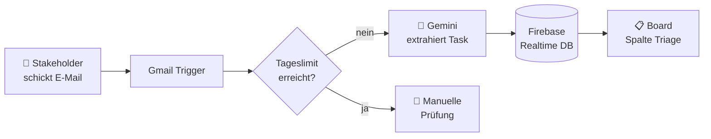

<div align="center">


# Join V2 AI

**Kanban-Projektmanagement mit KI-gestützter Ticket-Erstellung per E-Mail**


</div>

---

## Über das Projekt

**Join** ist ein Kanban-Board für Teams. Die V2 erweitert das Tool um einen KI-Workflow: Stakeholder schicken ihre Feature-Requests einfach per E-Mail, und eine KI erzeugt daraus automatisch ein Ticket mit Titel, Beschreibung, Deadline und Priorität. Das Ticket landet in der Spalte **Triage**, wo das Team es prüft und einplant.

## Features

| Bereich | Beschreibung |
| --- | --- |
| **Welcome** | Einstieg mit Rollenwahl: Stakeholder-Request oder Team-Login |
| **Stakeholder** | Erklärt den E-Mail-Workflow und zeigt das Tageslimit (10 KI-Requests/Tag) |
| **Login / Sign-up** | Authentifizierung über Firebase Auth, inkl. Gast-Login |
| **Summary** | Dashboard mit Kennzahlen (To do, Done, Urgent, nächste Deadline, E-Mail-Requests) |
| **Board** | Kanban mit den Spalten *Triage → To do → In progress → Await feedback → Done*, Drag & Drop, Suche, Detail- und Edit-Overlay |
| **Add Task** | Aufgaben mit Zuständigen, Fälligkeitsdatum, Priorität, Kategorie und Subtasks anlegen |
| **Contacts** | Kontakte anlegen, bearbeiten und löschen |
| **KI-Badge** | Von der KI erstellte Tasks sind auf dem Board gekennzeichnet |
| **Responsive** | Eigene Layouts für Desktop und Mobile |

## So funktioniert der E-Mail-Workflow



Der Workflow läuft in [n8n](https://n8n.io). Im Ordner [`n8n/`](n8n/) liegen zwei Exporte:

| Datei | Inhalt |
| --- | --- |
| [`Join – Email to Task.json`](n8n/Join%20%E2%80%93%20Email%20to%20Task.json) | **Sicherung des laufenden Workflows** direkt aus n8n, inkl. Verweisen auf die Credentials (ohne Schlüssel oder Tokens) |
| [`email-to-task.workflow.json`](n8n/email-to-task.workflow.json) | Neutrale Vorlage ohne Credential-Verweise, für ein frisches Setup |

Der Ablauf:

1. **Gmail Trigger** – reagiert auf neue E-Mails
2. **Prepare Email** – bereitet Betreff und Inhalt auf
3. **Get Request Counter / Check Limit** – prüft das Tageslimit
4. **Gemini: Extract Task** – lässt die KI Titel, Beschreibung, Priorität und Deadline bestimmen
5. **Build Task** – baut das Task-Objekt fürs Board
6. **Create Task in Firebase** – speichert den Task in der Realtime Database
7. **Increment Request Counter** – zählt den Request

## Tech Stack

- **Frontend:** Vanilla HTML, CSS und JavaScript (ES-Module), kein Build-Schritt
- **Backend:** Firebase Authentication und Realtime Database (SDK 10.12 per CDN)
- **Automatisierung:** n8n (Docker) mit Gmail- und Google-Gemini-Anbindung
- **Fonts:** Inter und Open Sans (lokal eingebunden)

## Projektstruktur

```
JoinV2AI/
├── index.html              # Welcome-Seite (Rollenwahl)
├── stakeholder.html        # Infoseite für Stakeholder
├── login.html              # Login & Sign-up
├── summary-board.html      # Dashboard
├── board.html              # Kanban-Board
├── addtask.html            # Task anlegen
├── contact.html            # Kontakte
├── help.html, legal-notice.html, privacy-policy.html
├── script.js               # Gemeinsame Logik (Header, Navigation, Profil)
├── style.css               # Globale Styles
├── scripts/
│   ├── firebase.js         # Firebase-Konfiguration (nicht im Repo)
│   ├── addtask/  board/  contacts/  login/  stakeholder/  summary/
│   └── templates.js        # HTML-Templates
├── style/                  # Seiten- und Responsive-Styles
├── assets/                 # Icons, Bilder, Fonts
└── n8n/
    ├── docker-compose.yml          # n8n-Setup (z. B. für ein NAS)
    ├── Join – Email to Task.json   # Sicherung des laufenden Workflows
    └── email-to-task.workflow.json # Neutrale Workflow-Vorlage
```

## Loslegen

### 1. Repository klonen

```bash
git clone https://github.com/dfo81/Join_V2_Ai.git
cd Join_V2_Ai
```

### 2. Firebase einrichten

Lege in der [Firebase Console](https://console.firebase.google.com) ein Projekt mit **Authentication** (E-Mail/Passwort) und **Realtime Database** an. Erstelle dann die Datei `scripts/firebase.js` (sie steht in `.gitignore`):

```js
import { initializeApp } from "https://www.gstatic.com/firebasejs/10.12.0/firebase-app.js";
import { getAuth } from "https://www.gstatic.com/firebasejs/10.12.0/firebase-auth.js";
import { getDatabase, ref, update, get, set, push, onValue }
  from "https://www.gstatic.com/firebasejs/10.12.0/firebase-database.js";

const firebaseConfig = {
  apiKey: "...",
  authDomain: "<projekt>.firebaseapp.com",
  databaseURL: "https://<projekt>-default-rtdb.<region>.firebasedatabase.app/",
  projectId: "<projekt>",
  storageBucket: "<projekt>.firebasestorage.app",
  messagingSenderId: "...",
  appId: "...",
};

const app = initializeApp(firebaseConfig);
const auth = getAuth(app);
const db = getDatabase(app);

export { auth, app, db, ref, update, get, set, push, onValue };
```

### 3. App starten

Da die Skripte ES-Module sind, muss die App über einen lokalen Webserver laufen (nicht per `file://`), z. B.:

- VS Code Extension **Live Server**, oder
- `npx serve .` bzw. `python3 -m http.server 8080`

Danach `http://localhost:8080` öffnen.

### 4. n8n-Workflow (optional)

```bash
cd n8n
docker compose up -d
```

- n8n unter `http://<host>:5678` öffnen
- In `docker-compose.yml` `N8N_HOST` und `WEBHOOK_URL` auf die eigene Adresse anpassen
- Workflow importieren (**Workflows → Import from File**):
  - `Join – Email to Task.json` zum Wiederherstellen der eigenen Instanz
  - `email-to-task.workflow.json` für ein neues Setup
- Credentials für **Gmail**, **Google Gemini** und **Firebase** hinterlegen
- Die Firebase-URLs in den HTTP-Nodes auf die eigene Datenbank ändern
- Workflow aktivieren bzw. veröffentlichen. Er wird danach durch jede neue E-Mail im Postfach ausgelöst.

> **Hinweis:** Die n8n-Daten (Credentials, Encryption Key) liegen in `n8n/n8n_data/` und werden nicht eingecheckt.

## Autor

**Dieter Foos** – [@dfo81](https://github.com/dfo81)
