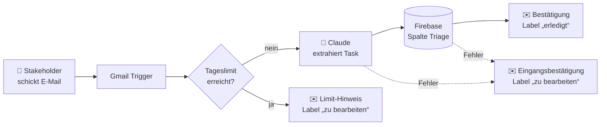

<div align="center">


# Join V2 AI

**Kanban-Projektmanagement mit KI-gestützter Ticket-Erstellung per E-Mail**


</div>

---

## Über das Projekt

**Join** ist ein Kanban-Board für Teams. Die V2 erweitert das Tool um einen KI-Workflow: Stakeholder schicken ihre Feature-Requests einfach per E-Mail, und eine KI erzeugt daraus automatisch ein Ticket mit Titel, Beschreibung, Deadline und Priorität. Das Ticket landet in der Spalte **Triage**, wo das Team es prüft und einplant. Der Absender bekommt eine Bestätigung und wird später per E-Mail informiert, sobald sich der Status seines Tickets ändert.

## Demo ausprobieren

**Live:** [joinai.dieter-foos.de](https://joinai.dieter-foos.de)

1. **Als Stakeholder:** Auf der Welcome-Seite *Create request* wählen. Die Stakeholder-Seite zeigt die E-Mail-Adresse und wie viele der 10 Requests heute noch frei sind.
2. **E-Mail schicken:** Den Wunsch oder Fehler formlos beschreiben, gern mit Deadline („bis Freitag“) oder Dringlichkeit („dringend“). Nach etwa einer Minute kommt eine Bestätigung mit dem angelegten Ticket.
3. **Als Team:** Über *Member log in* einloggen, z. B. per **Guest log in**. Auf dem **Board** steht das neue Ticket in **Triage**, mit KI-Badge, Kategorie, Priorität, Deadline und dem Absender als externem Ersteller.
4. **Status ändern:** Das Ticket in eine andere Spalte ziehen. Der Absender bekommt innerhalb einer Minute eine E-Mail mit dem neuen Status.

> Ist das Tageslimit erreicht, wird kein Ticket erstellt. Der Absender bekommt dann eine automatische Antwort, und die Mail wird vom Team manuell bearbeitet.

> **Betrieb der Live-Demo:** Das Frontend liegt auf [joinai.dieter-foos.de](https://joinai.dieter-foos.de), die Daten in Firebase. Die n8n-Workflows laufen als Docker-Container auf meinem privaten NAS im Heimnetz ([`n8n/docker-compose.yml`](n8n/docker-compose.yml)). n8n braucht keinen offenen Port nach außen: Es fragt Gmail jede Minute ab und schreibt direkt in Firebase. Ist das NAS offline, kommen Mails erst nach dem Neustart an. Nicht verarbeitete Mails bleiben im Posteingang liegen und werden dann nachgeholt.

## Features

| Bereich | Beschreibung |
| --- | --- |
| **Welcome** | Einstieg mit Rollenwahl: Stakeholder-Request oder Team-Login |
| **Stakeholder** | Erklärt den E-Mail-Workflow und zeigt das Tageslimit (10 KI-Requests/Tag) |
| **Login / Sign-up** | Authentifizierung über Firebase Auth, inkl. Gast-Login |
| **Summary** | Dashboard mit Kennzahlen (To do, Done, Urgent, nächste Deadline, E-Mail-Requests) |
| **Board** | Kanban mit den Spalten *Triage → To do → In progress → Await feedback → Done*, Drag & Drop, Suche, Detail- und Edit-Overlay |
| **Add Task** | Aufgaben mit Zuständigen, Fälligkeitsdatum, Priorität, Kategorie (User Story, Technical task, Bug) und Subtasks anlegen. Neue Tasks starten in Triage. |
| **Contacts** | Kontakte anlegen, bearbeiten und löschen |
| **KI-Badge** | Von der KI erstellte Tasks sind auf dem Board und im Beschreibungstext gekennzeichnet |
| **Ersteller** | Jeder Task zeigt seinen Ersteller, unterschieden nach intern (Teammitglied) und extern (Stakeholder per E-Mail) |
| **Responsive** | Eigene Layouts für Desktop und Mobile |

## So funktionieren die n8n-Workflows

Beide Workflows laufen in [n8n](https://n8n.io) und liegen als Export im Ordner [`n8n/`](n8n/). Die Exporte enthalten Verweise auf die Credentials, aber keine Schlüssel oder Tokens.

### E-Mail → Ticket ([`email-to-task.workflow.json`](n8n/email-to-task.workflow.json))



1. **Gmail Trigger** – fragt jede Minute den Posteingang ab (eigene Mails werden ignoriert)
2. **Prepare Email** – liest Absender, Betreff und Text aus und baut die KI-Anfrage
3. **Get Request Counter / Check Limit / Within Limit?** – prüft das Tageslimit von 10 Requests
4. **Claude: Extract Task** – bestimmt (Claude Haiku 4.5) Titel, Beschreibung, Kategorie (User Story, Technical task, Bug), Priorität und Deadline; bis zu 5 Versuche bei Überlastung
5. **Build Task** – prüft die KI-Antwort, ergänzt den Hinweis *„This ticket was AI-generated.“* und setzt den Absender als Ersteller
6. **Create Task in Firebase / Increment Request Counter** – legt den Task in **Triage** an und zählt den Request
7. **Reply: Ticket Created → Label: erledigt** – Bestätigung an den Absender, Mail wird nach „erledigt“ verschoben
8. **Reply: Limit Reached** bzw. bei Fehlern **Reply: Received → Label: zu bearbeiten** – Hinweis an den Absender, Mail wird nach „zu bearbeiten“ verschoben

### Statusänderung → Benachrichtigung ([`status-notification.workflow.json`](n8n/status-notification.workflow.json))

1. **Every Minute / Get Tasks** – liest jede Minute alle Tasks aus Firebase
2. **Find Column Changes** – vergleicht die Spalte mit `lastNotifiedColumn` und findet verschobene Tasks
3. **Notify Creator** – schickt dem Ersteller eine Mail mit altem und neuem Status
4. **Save Notified Column** – merkt sich die Spalte, damit jede Änderung nur einmal gemeldet wird

Dieser Weg braucht keinen öffentlich erreichbaren Webhook: n8n kann im Heimnetz bleiben, während die Webseite beim Hoster liegt.

## Tech Stack

- **Frontend:** Vanilla HTML, CSS und JavaScript (ES-Module), kein Build-Schritt
- **Backend:** Firebase Authentication und Realtime Database (SDK 10.12 per CDN)
- **Automatisierung:** n8n (Docker-Container auf einem privaten NAS) mit Gmail- und Claude-API-Anbindung
- **Fonts:** Inter und Open Sans (lokal eingebunden)

## Projektstruktur

```
JoinV2AI/
├── index.html              # Welcome-Seite (Rollenwahl)
├── stakeholder.html        # Infoseite für Stakeholder
├── login.html              # Login & Sign-up
├── summary-board.html      # Dashboard
├── board.html              # Kanban-Board
├── addtask.html            # Task anlegen
├── contact.html            # Kontakte
├── help.html, legal-notice.html, privacy-policy.html
├── script.js               # Gemeinsame Logik (Header, Navigation, Profil)
├── style.css               # Globale Styles
├── scripts/
│   ├── firebase.js         # Firebase-Konfiguration (nicht im Repo)
│   ├── addtask/  board/  contacts/  login/  stakeholder/  summary/
│   └── templates.js        # HTML-Templates
├── style/                  # Seiten- und Responsive-Styles
├── assets/                 # Icons, Bilder, Fonts
└── n8n/
    ├── docker-compose.yml          # n8n-Setup (z. B. für ein NAS)
    ├── email-to-task.workflow.json        # Workflow: E-Mail → Ticket
    └── status-notification.workflow.json  # Workflow: Statusänderung → Mail
```

## Loslegen

### 1. Repository klonen

```bash
git clone https://github.com/dfo81/Join_V2_Ai.git
cd Join_V2_Ai
```

### 2. Firebase einrichten

Lege in der [Firebase Console](https://console.firebase.google.com) ein Projekt mit **Authentication** (E-Mail/Passwort) und **Realtime Database** an. Erstelle dann die Datei `scripts/firebase.js` (sie steht in `.gitignore`):

```js
import { initializeApp } from "https://www.gstatic.com/firebasejs/10.12.0/firebase-app.js";
import { getAuth } from "https://www.gstatic.com/firebasejs/10.12.0/firebase-auth.js";
import { getDatabase, ref, update, get, set, push, onValue }
  from "https://www.gstatic.com/firebasejs/10.12.0/firebase-database.js";

const firebaseConfig = {
  apiKey: "...",
  authDomain: "<projekt>.firebaseapp.com",
  databaseURL: "https://<projekt>-default-rtdb.<region>.firebasedatabase.app/",
  projectId: "<projekt>",
  storageBucket: "<projekt>.firebasestorage.app",
  messagingSenderId: "...",
  appId: "...",
};

const app = initializeApp(firebaseConfig);
const auth = getAuth(app);
const db = getDatabase(app);

export { auth, app, db, ref, update, get, set, push, onValue };
```

### 3. App starten

Da die Skripte ES-Module sind, muss die App über einen lokalen Webserver laufen (nicht per `file://`), z. B.:

- VS Code Extension **Live Server**, oder
- `npx serve .` bzw. `python3 -m http.server 8080`

Danach `http://localhost:8080` öffnen.

### 4. n8n-Workflow (optional)

```bash
cd n8n
docker compose up -d
```

- n8n unter `http://<host>:5678` öffnen
- In `docker-compose.yml` `N8N_HOST` und `WEBHOOK_URL` auf die eigene Adresse anpassen
- In Gmail die Labels **„erledigt“** und **„zu bearbeiten“** anlegen
- Beide Workflows importieren (**Workflows → Import from File**)
- Credentials für **Gmail**, **Claude API** (Header Auth, Header-Name `x-api-key`, Key aus der Claude Console) und **Firebase** (Google Service Account) hinterlegen
- In den Nodes **„Label: erledigt“** und **„Label: zu bearbeiten“** das jeweilige Gmail-Label auswählen
- Die Firebase-URLs in den HTTP-Nodes auf die eigene Datenbank ändern
- Beide Workflows aktivieren bzw. veröffentlichen

> **Testen:** Mails, die das verbundene Gmail-Konto selbst verschickt, werden ignoriert (`-from:me`). So lösen die automatischen Antworten keine Schleife aus. Test-Requests deshalb von einer anderen Adresse schicken.

> **Hinweis:** Die n8n-Daten (Credentials, Encryption Key) liegen in `n8n/n8n_data/` und werden nicht eingecheckt.

## Autor

**Dieter Foos** – [@dfo81](https://github.com/dfo81)
